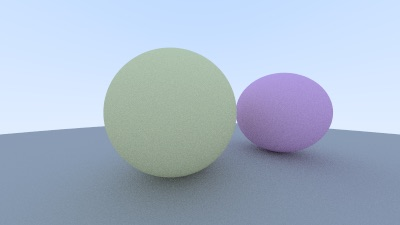

# Ray Tracing in One Weekend

This project follows the "Ray Tracing in One Weekend" book by Peter Shirley.

My latest result (400 samples, 10 bounces):



## Common commands

```
cmake --build build/Debug && ./build/Debug/raytracer test.ppm
```

## Building the Project

### Prerequisites

- CMake (version 3.10 or higher)
- A C++17 compatible compiler

### Build Instructions

#### On macOS/Linux

```shell
# Configure and build release binaries under `build/Release`
cmake -B build/Release -DCMAKE_BUILD_TYPE=Release
cmake --build build/Release

# Configure and build debug binaries under `build/Debug`
cmake -B build/Debug -DCMAKE_BUILD_TYPE=Debug
cmake --build build/Debug
```

#### On Windows (with Visual Studio)

```shell
# Configure and build release binaries
cmake -B build -G "Visual Studio 17 2022" -A x64
cmake --build build --config Release

# Build debug binaries
cmake --build build --config Debug
```

## Running the Renderer

To run the raytracer and save the output to a PPM file:

```shell
# On Linux/macOS
./build/Release/raytracer > image.ppm

# On Windows
.\build\Release\raytracer.exe > image.ppm
```

The output is in PPM format, which can be viewed with many image viewers or converted to other formats using tools like ImageMagick.
